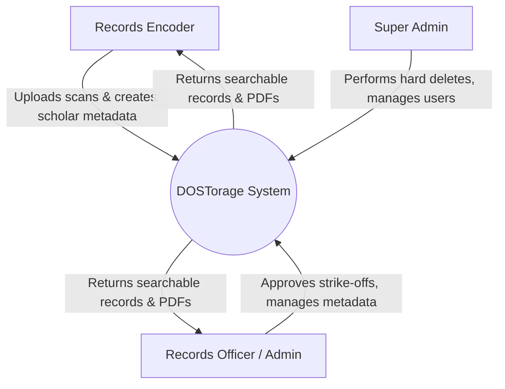
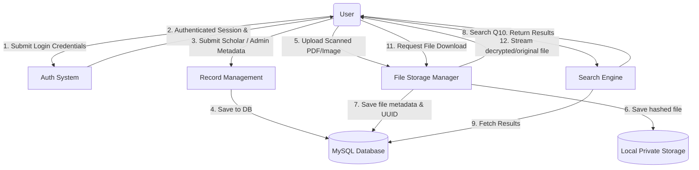
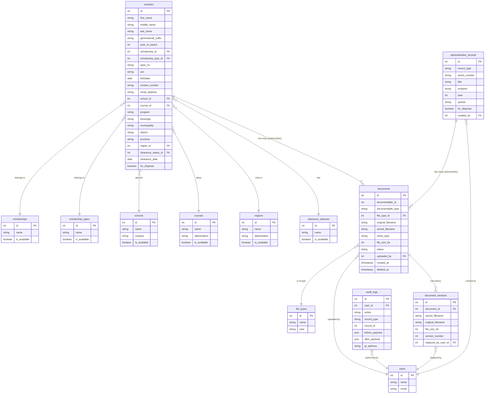

# DOSTorage Architecture

## 1. Context Diagram

## 2. Data Flow Diagram (DFD) - Level 0

## 3. Entity Relationship Diagram (ERD)

## 4. Approved Architecture Decisions
- **Framework**: Laravel 11 + Livewire + Spatie Permissions
- **Deployment**: Local Docker environment (Sail) offline on a single LAN server.
- **File Storage**: Local private disk with UUID hashed filenames, polymorphic relationships for documents (ADR-005).
- **Concurrency**: Simple locking strategy for records to prevent duplicate entry.
- **Search**: Scoped to Name, SPAS No, Award Year, School, and Course for scholars.
- **Schema**: Additive tables on top of DOST's draft schema (ADR-006).
