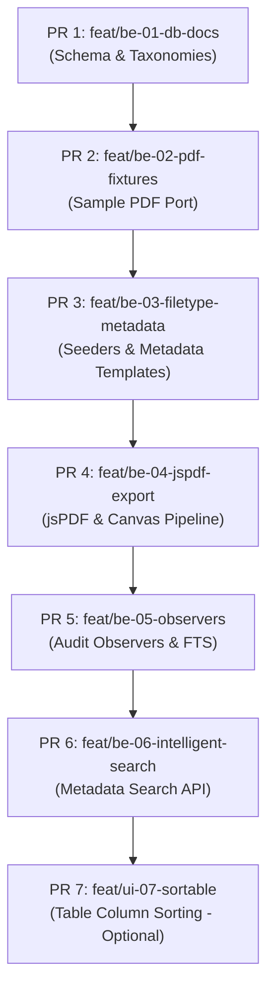

# FINAL_SETTLED_IMPLEMENTATION_PLAN.md — Unified Backend-to-Mother Stitch Plan

**Status:** SETTLED & LOCKED  
**Date:** 2026-07-29  
**Reconciliation Baseline:** Section-by-Section Synthesis of `IMPLEMENTATION_PLAN_HERMES.md` and `IMPLEMENTATION_PLAN_AGY.md`  
**Mother Repo:** `xxch4nnn/DOST-S-T-SECTION-PROJECT` (`db34ff9`)  
**Wakin Lab Repo:** `_backend_scratch/wakin` (`WakenMac/DOST-RXI-OJT_SQL-Files` @ `b3510d9`)  

---

## Executive Summary & Hard Constraints

This document represents the final, authoritative implementation plan for stitching Wakin’s backend OJT lab functionality into the mother `DOSTorage` codebase. It synthesizes the findings of `IMPLEMENTATION_PLAN_HERMES.md` and `IMPLEMENTATION_PLAN_AGY.md`, resolving all structural and schema conflicts while enforcing five mandatory architectural constraints:

> [!IMPORTANT]
> **5 Non-Negotiable Hard Architectural Constraints:**
> 1. **Canonical Database Tables:** `documents` and `document_versions` are the sole canonical tables for file management.
> 2. **Flat `files` Table Dropped:** The flat `files` table from Wakin's lab (`2026_07_20_061543_create_files_table.php`) is permanently dropped and will NOT be migrated into mother.
> 3. **DomPDF Dropped:** DomPDF scaffolding (`config/dompdf.php`, `views/pdf/compiled_images.blade.php`) is completely eliminated. All PDF compilation and page manipulation will use `jsPDF` and `SortableJS`.
> 4. **Three-Way Duplicate Modal Preserved:** The Livewire three-way duplicate handling modal (**Keep History** / **Overwrite** / **Cancel**) is retained in the UI (`Scholars/Show.php` and `AdminRecords/Show.php`).
> 5. **Immutable Revision History on Save:** Every document save, page re-ordering, split, or merge action creates a new record in `document_versions`. Direct in-place overwriting without version tracking is forbidden.

---

## 1. Confirmed Findings & Codebase Audit Baseline

A section-by-section reconciliation of the Wakin OJT practice repository against the mother codebase (`DOSTorage`) establishes the following baseline:

### 1.1 Schema & Infrastructure Comparison

| Category / Component | Wakin Lab State (`b3510d9`) | Mother Repo State (`db34ff9`) | Settled Architectural Resolution |
|---|---|---|---|
| **Storage Table** | Flat `files` table with `metadata` JSON | `documents` table with polymorphic `documentable_*` columns | **Drop `files` table.** Use mother's `documents` table as canonical storage entity. |
| **Version History** | Soft deletes on `files` (No version table) | `document_versions` table with `version_number` and `replaced_by_user_id` | **Use `document_versions`.** Enforce new `document_version` write on every save. |
| **Taxonomy Schema** | `file_groups` + `file_types` (`metadata_template` JSON) | Stale `file_types` (missing `file_group_id` & `metadata_template`) | **Port & Upgrade:** Add `file_groups` migration and upgrade `file_types` migration. |
| **Audit Logging** | `audit_logs` table (`2026_07_20_061552`) | `audit_logs` table (`2026_07_15_095056`) | **Schemas Match.** Wire model observers to emit `audit_logs` records. |
| **Observers** | `FileObserver.php` & `ScholarObserver.php` | No document/scholar audit observers | **Port & Refactor:** Port `ScholarObserver` (FTS) and create `DocumentObserver` (Audit Log). |
| **Fixture PDFs** | 21 PDFs across 6 folders in `database/sample_pdfs/` | Missing fixture directory | **Port Fixtures:** Copy `database/sample_pdfs/` tree into mother for test seeding. |
| **PDF Rendering Stack** | DomPDF scaffold + client `jsPDF`/`sortablejs` experiment | Clean state (No DomPDF, no `jspdf` installed) | **Drop DomPDF completely.** Install `jspdf` + `sortablejs` via npm in mother. |

### 1.2 Pre-Existing Mother Capabilities Integrated

- **`DocumentController@download`**: Pre-existing route (`routes/web.php`) returning physical file responses from `Storage::disk('local')->path('documents/' . $document->stored_filename)`.
- **Livewire Duplicate Handling**: Pre-existing methods (`duplicateDocument`) and modal views in `app/Livewire/Scholars/Show.php` and `app/Livewire/AdminRecords/Show.php` supporting the 3-way duplicate choices (**Keep History**, **Overwrite**, **Cancel**).

---

## 2. Schema Conflict Resolution & Data Rules

### 2.1 Storage & Polymorphic Ownership
- **Polymorphic Morph Rule:** Document ownership is strictly managed via `documents.documentable_type` and `documents.documentable_id`.
  - Scholar Documents: `documentable_type = App\Models\Scholar`
  - Administrative Records: `documentable_type = App\Models\AdministrativeRecord`
- **Metadata Separation:** Foreign keys such as `scholar_id` or `record_id` must NEVER be duplicated inside `documents.metadata` JSON. The `metadata` field stores form-specific data only (e.g., `academic_year`, `semester`, `payroll_number`, `series_number`).
- **Column Naming Standardization:** The JSON schema definition column on `file_types` is locked as **`metadata_template`**.

### 2.2 Versioning & Three-Way Duplicate Workflow
- **`documents` Table:** Represents the current active document state, status (`active` vs. `struck_off`), and current file pointer (`stored_filename`).
- **`document_versions` Table:** Maintains full audit history (`version_number`, `file_path`, `metadata_snapshot`, `replaced_by_user_id`, `created_at`).
- **Save Operation Trigger:** Any edit, re-ordering via SortableJS, page insert/split, or upload overwrite writes a new entry to `document_versions`.
- **Three-Way Duplicate Modal:**
  - **Keep History:** Creates a new `document_versions` entry linked to the existing `documents` parent record, updating the parent to point to the newest file path.
  - **Overwrite:** Archives current state into `document_versions` and replaces the active `documents` metadata and file path.
  - **Cancel:** Aborts the upload transaction without touching disk or DB.

### 2.3 Primary Searchable Metadata Keys Indexing
To prevent unindexed full-table JSON scans across MySQL, search queries target **one primary metadata key per category**:

1. **Scholar Documents** (Group 1: COR, Grades, Agreement): `scholar_id` (via morph relation) + `academic_year` / `semester`
2. **Memorandums**: `series_number`
3. **Annual & Quarterly Financial Reports**: `report_number` / `project`
4. **Payrolls**: `payroll_number`
5. **Endorsements**: `school_id`
6. **Communications**: `title`

---

## 3. Client-Side Canvas & jsPDF Port Plan

### 3.1 Functional Scope
- **Included (V1 Scope):**
  - **(a) Export Scholar Documents:** Compiling multiple scholar document pages into a unified multi-page PDF output.
  - **(b) Canvas Page Manipulation:** Drag-and-drop thumbnail page reordering, page deletion, page merging, and inserting pages into an active session.
- **Excluded:** Direct inline text/annotation editing in V1.

### 3.2 Responsibility & Ownership Split
- **Front-End (Rui):** SortableJS integration, drag-and-drop thumbnail grid UI, page reorder animations, rendering thumbnail canvases (max 800px width for performance), and exporting `pageOrderArray` payload.
- **Back-End (Wakin):** Livewire action handlers, `FormRequest` validation against `metadata_template`, jsPDF file path persistence on disk (`storage/app/documents/`), and writing new entries to `document_versions`.

### 3.3 Dependencies & Build Setup
- Run in mother codebase:
  ```bash
  npm install jspdf sortablejs
  ```
- Import and register in `resources/js/app.js`:
  ```javascript
  import Sortable from 'sortablejs';
  import { jsPDF } from 'jspdf';

  window.Sortable = Sortable;
  window.jsPDF = jsPDF;
  ```

---

## 4. PR Slice Order with Exact Paths

The stitch execution is broken down into 7 sequential PR slices.



### Slice Details & File Targets

| Slice | Title | Description & Target Files | Owner |
|---|---|---|---|
| **PR 1** | `feat/be-01-db-docs` | **Database Schema Foundation:** Create `file_groups` migration, upgrade `file_types` migration to include `file_group_id` and `metadata_template`, align `Document` and `DocumentVersion` models. Verify drop of `files` migration.<br/>• `database/migrations/2026_07_20_061506_create_file_groups_table.php` (New)<br/>• `database/migrations/2026_07_15_095051_create_file_types_table.php` (Modify)<br/>• `app/Models/FileGroup.php` (New)<br/>• `app/Models/FileType.php` (Modify)<br/>• `app/Models/Document.php` & `DocumentVersion.php` (Verify) | Wakin |
| **PR 2** | `feat/be-02-pdf-fixtures` | **Sample PDF Fixture Import:** Port sample PDF directory tree from lab into mother repo for testing.<br/>• `database/sample_pdfs/Annual_Financial_Reports/*`<br/>• `database/sample_pdfs/Certificate_Of_Registration/*`<br/>• `database/sample_pdfs/Endorsements/*`<br/>• `database/sample_pdfs/Memorandums/*`<br/>• `database/sample_pdfs/Payrolls/*`<br/>• `database/sample_pdfs/Quarterly_Financial_Reports/*` | Wakin |
| **PR 3** | `feat/be-03-filetype-metadata` | **Seeders & Reactive Upload Forms:** Seed 2 file groups and 18 file types with JSON `metadata_template`. Wire dynamic form builder into Livewire upload modals.<br/>• `database/seeders/FileGroupSeeder.php` (New)<br/>• `database/seeders/FileTypeSeeder.php` (Port)<br/>• `database/seeders/DatabaseSeeder.php` (Update)<br/>• `app/Livewire/Scholars/Show.php` & `AdminRecords/Show.php` | Wakin + Rui |
| **PR 4** | `feat/be-04-jspdf-export` | **jsPDF Canvas & Versioned Save Pipeline:** Install `jspdf` and `sortablejs`, build canvas reorder modal UI, write save handler enforcing new `document_versions` write.<br/>• `package.json`<br/>• `resources/js/app.js`<br/>• `resources/views/livewire/document-canvas-editor.blade.php`<br/>• `app/Livewire/DocumentCanvasEditor.php`<br/>• `app/Http/Controllers/DocumentController.php` | Rui + Wakin |
| **PR 5** | `feat/be-05-observers` | **Audit Observers & FTS Integration:** Port `ScholarObserver` (FTS `fts_search_data` compilation) and create `DocumentObserver` for `AuditLog` generation.<br/>• `app/Observers/ScholarObserver.php` (Port)<br/>• `app/Observers/DocumentObserver.php` (New)<br/>• `app/Observers/FileTypeObserver.php` (New)<br/>• `app/Providers/AppServiceProvider.php` | Wakin |
| **PR 6** | `feat/be-06-intelligent-search` | **Indexed Metadata & FTS Search Scope:** Implement `DocumentSearchService` searching primary indexed metadata keys and scholar full-text strings.<br/>• `app/Services/DocumentSearchService.php` (New)<br/>• `app/Livewire/Search/GlobalSearch.php` | Wakin |
| **PR 7** | `feat/ui-07-sortable` | **Table Column Sort (Optional):** Add table header column sorting for Scholar and Admin Record index tables (separate from canvas SortableJS).<br/>• `app/Livewire/Scholars/Index.php`<br/>• `app/Livewire/AdminRecords/Index.php` | Rui |

---

## 5. Risk Matrix & Mitigations

| Risk Scenario | Impact | Technical Mitigation Strategy |
|---|---|---|
| **JSON Metadata Mismatch** | Invalid data bypassing schema constraints | **Hard Validation Abort:** Livewire / FormRequest validates incoming `metadata` keys against `metadata_template` before DB/disk write. Abort with HTTP 422 error bag. |
| **Browser Memory Bloat on PDF Sort** | UI freeze when sorting 50+ page PDFs | Constrain canvas thumbnail renders to low DPR (max width 800px). Generate full-resolution output only during final jsPDF `.save()` compile. |
| **Bypassing Morph Ownership** | Developers adding `metadata.scholar_id` | Add automated Pest/PHPUnit tests ensuring `documents.documentable_type` and `documentable_id` are strictly enforced. |
| **DomPDF Residual Calls** | Dead code or broken route execution | Remove `config/dompdf.php` and delete `views/pdf/compiled_images.blade.php` during PR 4 merge. |
| **Missing Version Entries** | Save operations overwriting active files silently | Enforce DB transaction hook in `Document` model / controller: any update to `stored_filename` or `metadata` must create a `DocumentVersion`. |

---

## 6. Settlement & Pre-Stitch Lock Checklist

- [x] Confirmed `documents` + `document_versions` are canonical tables.
- [x] Confirmed flat `files` table is dropped.
- [x] Confirmed DomPDF is completely removed.
- [x] Confirmed three-way duplicate modal (Keep History / Overwrite / Cancel) is preserved in Livewire views.
- [x] Confirmed every Save operation writes a new `document_version`.
- [x] Verified PR slice sequence (PR 1 through PR 7) and target file paths.
- [ ] Execute `npm install jspdf sortablejs` upon PR 4 initiation.
- [ ] Require mandatory test suite pass before merging each PR slice into `feat/fe-08-fullstack-hardening-v2`.
