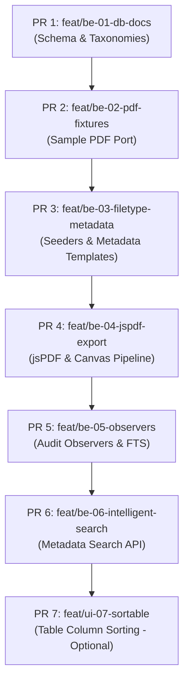

# IMPLEMENTATION_PLAN_AGY.md — Backend-to-Mother Stitch Execution Plan

**Author:** AGY Assistant (Pairing with Chan)  
**Date:** 2026-07-29  
**Source Spec:** `planning/AGY_HANDOFF_BACKEND_STITCH.md`  
**Mother Repo:** `xxch4nnn/DOST-S-T-SECTION-PROJECT`  
**Wakin Lab Repo:** `_backend_scratch/wakin` (`WakenMac/DOST-RXI-OJT_SQL-Files`)  

---

## 1. Confirmed Findings (Wakin Lab vs. Mother Repo)

A comprehensive empirical audit was performed comparing Wakin's practice OJT lab (`_backend_scratch/wakin/dost_system`) against the mother codebase (`DOSTorage`).

### 1.1 Schema & Migrations Comparison

| Entity / Schema | Wakin OJT Lab Status | Mother Repo Status | Status & Stitch Alignment |
|---|---|---|---|
| **Storage Table** | `files` table (`2026_07_20_061543_create_files_table.php`) with flat structure & `metadata` JSON | `documents` table (`2026_07_15_095054_create_documents_table.php`) with polymorphic `documentable_*` morphs | **Conflicted & Resolved:** `files` table is dropped. Mother's `documents` table is canonical. |
| **Version Control** | None (uses soft deletes on `files`) | `document_versions` (`2026_07_15_095055_create_document_versions_table.php`) with `version_number` & `replaced_by_user_id` | **Aligned:** Mother's `document_versions` is canonical. Every save path writes a version record. |
| **File Taxonomy** | `file_groups` (`2026_07_20_061506`) & `file_types` (`2026_07_20_061515`) with `metadata_template` JSON | `file_types` (`2026_07_15_095051`) missing `file_group_id` & `metadata_template` | **Port Required:** Port Wakin's `file_groups` migration and upgrade `file_types` to include `file_group_id` and `metadata_template`. |
| **Audit Logging** | `audit_logs` (`2026_07_20_061552`) | `audit_logs` (`2026_07_15_095056`) | **Aligned:** Schema matches. Observers in mother will write to `audit_logs`. |
| **Observers** | `FileObserver.php` & `ScholarObserver.php` present in lab | None | **Port & Expand:** Port `ScholarObserver` (FTS) and create `DocumentObserver` (Audit Log), plus observers for all CRUD models. |
| **Sample PDF Fixtures** | 21 PDFs across 6 category folders in `database/sample_pdfs/` | Folder missing | **Port Required:** Port complete `database/sample_pdfs/` directory tree into mother. |
| **PDF Rendering Stack** | Scaffolding for DomPDF (`config/dompdf.php`, `views/pdf/compiled_images.blade.php`) + jsPDF/SortableJS client experimentation | Clean (no DomPDF installed, no jsPDF dependencies in `package.json`) | **Decision Locked:** Drop DomPDF completely. Install `jspdf` + `sortablejs` via Vite/npm in mother. |

### 1.2 Mother Codebase Pre-Existing Capabilities

- **`DocumentController.php`**: Pre-existing `download(Document $document)` route returning `response()->download()` from `Storage::disk('local')->path('documents/' . $document->stored_filename)`.
- **Livewire Components (`app/Livewire/Scholars/Show.php` & `app/Livewire/AdminRecords/Show.php`)**: Already contain state handlers for document lists, upload modals, duplicate document detection (`duplicateDocument`), and three-way duplicate options (Keep History / Overwrite / Cancel).
- **Vite & Package Dependencies**: Currently has Bootstrap 5.3, Phosphor Icons, Sass, Axios. Lacks `jspdf` and `sortablejs`.

---

## 2. Schema Conflict Resolution

All schema conflicts have been resolved following Wakin's explicit Q1–Q12 handoff answers (documented in `project_bible_v02_extracted.md` and locked in `_backend_stitch_components.md`).

### 2.1 Storage & Polymorphic Ownership (Q2, Q3)
- **Flat `files` table is dropped.** No `files` table will be created in mother.
- **Polymorphic ownership (`documents.documentable_type` / `documents.documentable_id`)** is canonical:
  - Scholar documents: `documentable_type` = `App\Models\Scholar`
  - Administrative records: `documentable_type` = `App\Models\AdministrativeRecord`
- **Linkage Rule:** `scholar_id` or `record_id` must NEVER be stored inside `documents.metadata`. Ownership is strictly enforced by morph FKs. `metadata` JSON stores form-specific values only (e.g., `academic_year`, `semester`, `payroll_number`).
- **Column Naming:** The JSON schema definition column on `file_types` is canonically named **`metadata_template`** (not `metadata`).

### 2.2 Versioning & Duplicate Handling (Q4, Q5)
- **`documents` Table:** Holds the current active file metadata, storage path, status (`active` vs. `struck_off`), and timestamps (`created_at`, `updated_at`, `deleted_at`).
- **`document_versions` Table:** Stores full revision history (`version_number`, `replaced_by_user_id`, `file_path`, `metadata_snapshot`, `updated_at`).
- **Save Behavior:** Every save or page re-order/split operation creates a new `document_versions` entry.
- **Three-Way Duplicate Modal (Keep History / Overwrite / Cancel):** Preserved in UI to give encoders intentional control when uploading files with existing names/types.

### 2.3 Primary Searchable Metadata Keys (Q9)
To optimize indexing and prevent expensive unstructured JSON queries across MySQL, V1 limits searchable metadata indexing to **one primary key per file type / category**:

1. **Scholar Documents** (Group 1: COR, Grades, Agreement): `scholar_id` (via morph relationship) + `academic_year` / `semester`.
2. **Memorandums**: `series_number`
3. **Annual & Quarterly Financial Reports**: `report_number` / `project`
4. **Payrolls**: `payroll_number`
5. **Endorsements**: `school_id`
6. **Communications**: `title`

---

## 3. Client-Side Canvas & jsPDF Port Plan

Based on `jspdf_versioning.md` and Wakin's responses to Q6, Q7, Q8, and Q12:

### 3.1 V1 Functional Scope (a + b)
- **(a) Export Scholar Documents:** Ability to compile multiple scholar documents or pages into a single output PDF.
- **(b) Page Manipulation:** Drag-and-drop page reordering, page deletion, page merging, and inserting pages between existing pages within an active editing session.
- **Exclusion:** No inline text/annotation editing in V1.

### 3.2 Responsibility & Ownership Split (Q7)
- **Front-End Owner (Rui):** SortableJS integration, drag-and-drop canvas UI, thumbnail grid layout, page reorder animation, CSS data extraction (`pageOrderArray`).
- **Back-End Owner (Wakin):** Livewire action handler, FormRequest validation, metadata template parsing, jsPDF output storage path, and `document_versions` DB persistence.

### 3.3 Dependencies & Build Setup (Q8, Q12)
- DomPDF is completely removed from the pipeline.
- Packages installed via npm:
  ```bash
  npm install jspdf sortablejs
  ```
- Modules imported in `resources/js/app.js`:
  ```javascript
  import Sortable from 'sortablejs';
  import { jsPDF } from 'jspdf';
  window.Sortable = Sortable;
  window.jsPDF = jsPDF;
  ```

---

## 4. PR Slice Order & Execution Sequence

The backend-to-mother stitch is broken down into 7 isolated PR slices. Each slice defines exact file targets and assignment.



### Slice Details

#### PR 1: `feat/be-01-db-docs` (Database & Model Foundation)
- **Goal:** Establish `file_groups` taxonomy table, update `file_types` schema, and verify `documents` + `document_versions` models.
- **Owner:** Wakin (BE)
- **Target Files:**
  - `database/migrations/2026_07_20_061506_create_file_groups_table.php` (New)
  - `database/migrations/2026_07_15_095051_create_file_types_table.php` (Modify to add `file_group_id`, `metadata_template`)
  - `app/Models/FileGroup.php` (New)
  - `app/Models/FileType.php` (Update fillables & relations)
  - `app/Models/Document.php` (Verify morphs & versions relation)
  - `app/Models/DocumentVersion.php` (Verify relation to Document)

#### PR 2: `feat/be-02-pdf-fixtures` (Sample Fixtures Integration)
- **Goal:** Copy Wakin lab sample PDFs into mother repository fixture tree for automated testing and manual demo encoding.
- **Owner:** Wakin (BE)
- **Target Files:**
  - `database/sample_pdfs/Annual_Financial_Reports/*`
  - `database/sample_pdfs/Certificate_Of_Registration/*`
  - `database/sample_pdfs/Endorsements/*`
  - `database/sample_pdfs/Memorandums/*`
  - `database/sample_pdfs/Payrolls/*`
  - `database/sample_pdfs/Quarterly_Financial_Reports/*`

#### PR 3: `feat/be-03-filetype-metadata` (Seeders & Reactive Form Fields)
- **Goal:** Seed 2 file groups and 18 file types with their JSON `metadata_template` contracts. Enforce strict validation on upload.
- **Owner:** Wakin (BE)
- **Target Files:**
  - `database/seeders/FileGroupSeeder.php` (New)
  - `database/seeders/FileTypeSeeder.php` (Port from lab)
  - `database/seeders/DatabaseSeeder.php` (Register seeders)
  - `app/Livewire/Scholars/Show.php` (Integrate metadata form builder)
  - `app/Livewire/AdminRecords/Show.php` (Integrate metadata form builder)

#### PR 4: `feat/be-04-jspdf-export` (jsPDF & Sortable Canvas Pipeline)
- **Goal:** Add jsPDF + SortableJS npm dependencies, build client-side page canvas reordering modal, and write save path into `document_versions`.
- **Owner:** Rui (FE Canvas UI) & Wakin (BE Save Handler)
- **Target Files:**
  - `package.json` (Add `jspdf`, `sortablejs`)
  - `resources/js/app.js` (Export Sortable & jsPDF)
  - `resources/views/livewire/document-canvas-editor.blade.php` (New UI)
  - `app/Livewire/DocumentCanvasEditor.php` (New Component)

#### PR 5: `feat/be-05-observers` (Audit Observers & FTS Compilation)
- **Goal:** Port `ScholarObserver` (FTS `fts_search_data` compilation) and implement `DocumentObserver` + model observers for `AuditLog` generation.
- **Owner:** Wakin (BE)
- **Target Files:**
  - `app/Observers/ScholarObserver.php` (Port from lab)
  - `app/Observers/DocumentObserver.php` (New)
  - `app/Observers/FileTypeObserver.php` (New)
  - `app/Providers/AppServiceProvider.php` (Register observers)

#### PR 6: `feat/be-06-intelligent-search` (Indexed Metadata Search Engine)
- **Goal:** Build search logic querying indexed primary metadata keys and `ScholarObserver` full-text search string.
- **Owner:** Wakin (BE)
- **Target Files:**
  - `app/Services/DocumentSearchService.php` (New)
  - `app/Livewire/Search/GlobalSearch.php` (Update search handler)

#### PR 7: `feat/ui-07-sortable` (Table Column Sorting - Optional)
- **Goal:** Implement table header column sorting for Scholar Index and Admin Records Index tables (separate from canvas SortableJS).
- **Owner:** Rui (FE)
- **Target Files:**
  - `app/Livewire/Scholars/Index.php`
  - `app/Livewire/AdminRecords/Index.php`

---

## 5. Risks & Mitigations

| Risk Scenario | Impact | Mitigation Strategy |
|---|---|---|
| **JSON Metadata Template Mismatch (Q11)** | Invalid or corrupt data saved when an encoder bypasses field rules | **Hard Abort Validation:** FormRequest / Livewire component must validate incoming `metadata` key types against `metadata_template` rules before any DB insert or disk write. Abort with HTTP 422 / Livewire error bag. |
| **Large PDF Memory Bloat in Browser** | Canvas crashes on memory allocation when sorting 50+ page PDFs | Render canvas page thumbnails at constrained DPR / canvas width (max 800px width), compiling to high-res PDF only on final jsPDF `.save()` call. |
| **Bypassing Morph Ownership** | Developers accidentally introducing `metadata.scholar_id` queries | Add strict model scope / accessor tests enforcing `documentable_type` and `documentable_id` usage. |
| **Vite JS Bundle Expansion** | Slow initial page loads due to jsPDF inclusion | Dynamic import of `jspdf` and `sortablejs` inside canvas editor modal entry point. |

---

## 6. Open Items & Pre-Stitch Lock Checklist

Before PR 1 is opened for review:

- [x] Confirmed Wakin lab repo is non-shallow (`is-shallow-repository` = false).
- [x] Verified canonical target tables in mother repo (`documents` + `document_versions`).
- [x] Confirmed dropping of flat `files` table and DomPDF stack.
- [x] Confirmed primary searchable metadata keys with Wakin's handoff sign-off.
- [ ] Run `npm install jspdf sortablejs` in mother branch when PR 4 opens.
- [ ] Final sign-off from Chan and Wakin on PR slice assignments.
